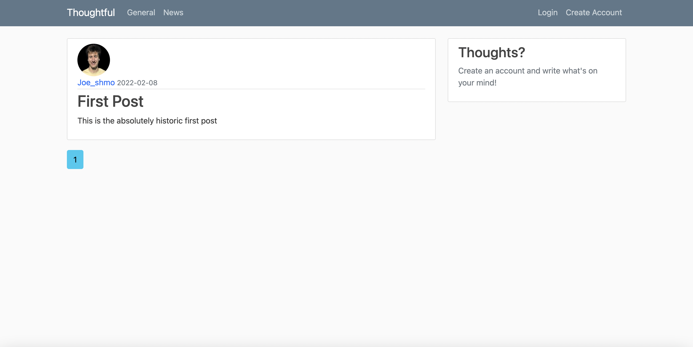
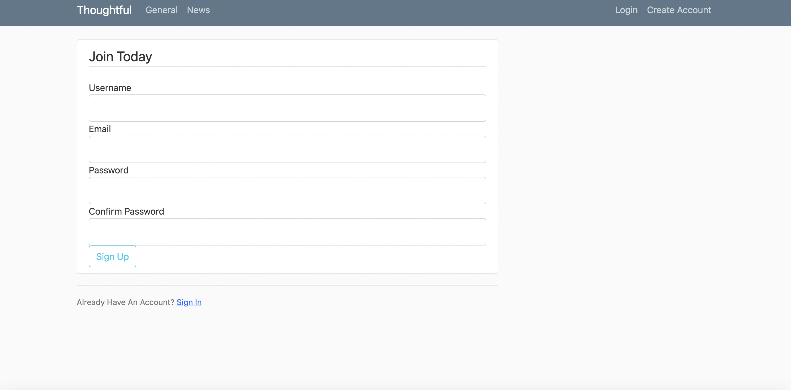
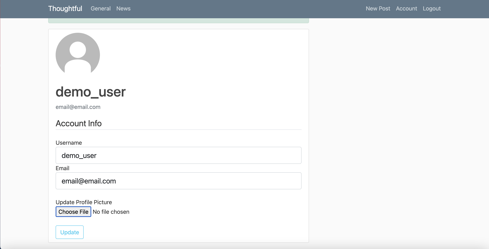
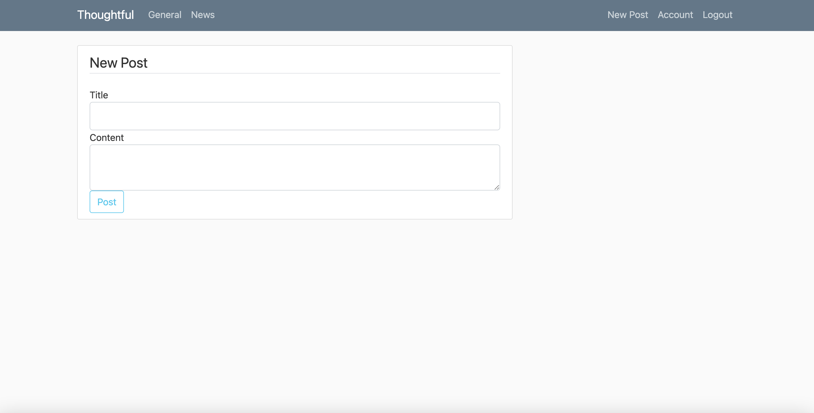

## Social Media Web App
The goal of this project was to increase my skills in both backend and frontend web development using Python's Flask and HTML/CSS. Below you can see screenshots and a link to the page.

## Screenshots

## Link
https://social-media-site-341001.wl.r.appspot.com/

